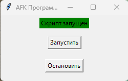

# AntiAFK для Space Station 14 (SS14)

## Описание

Это приложение предназначено для автоматического предотвращения режима AFK (отсутствия активности) в игре Space Station 14. Для корректной работы приложения необходимо запускать игру в оконном режиме.

## Как использовать

1. **Запустите игру в оконном режиме.**
2. **Запустите EXE-файл данного приложения.**
3. **Нажмите кнопку "Запустить" в интерфейсе приложения для активации анти-AFK.**
4. **Переключитесь обратно в игру.**

* **Если нужно остановить работу приложения, нажмите кнопку "Остановить".**

## Другие наши проекты для SS14:

- **Автоматическая химия для SS14**: [AutoTools SS14](https://github.com/gigachop/SS14_AntiAFK?tab=readme-ov-file)

## Авторство

- **Discord**: giga_chop
- **Telegram**: [giga_chop](https://t.me/giga_chop)

## Поиск по ключевым словам

- Space Station 14 моды
- SS14 анти-AFK бот
- Space Station 14 читы
- Space Station 14 игровой инструмент
- SS14 утилиты
- Анти-AFK скрипты для SS14
- Space Station 14 гайды
- Как оставаться активным в SS14
- Программа против AFK в Space Station 14
- SS14 поддержка игроков
- Инструменты для улучшения игры в Space Station 14
- Space Station 14 активность
- SS14 читы
- Решения AFK для игроков SS14
- Улучшения для Space Station 14
- Анти-AFK системы для SS14

## Keyword Search
- Space Station 14 mods
- SS14 anti-AFK bot
- Space Station 14 cheats
- Space Station 14 gaming tool
- SS14 utilities
- Anti-AFK scripts for SS14
- Space Station 14 guides
- How to stay active in SS14
- Anti-AFK program for Space Station 14
- SS14 player support
- Tools to improve gameplay in Space Station 14
- Space Station 14 activity
- SS14 cheats
- AFK solutions for SS14 players
- Enhancements for Space Station 14
- Anti-AFK systems for SS14
